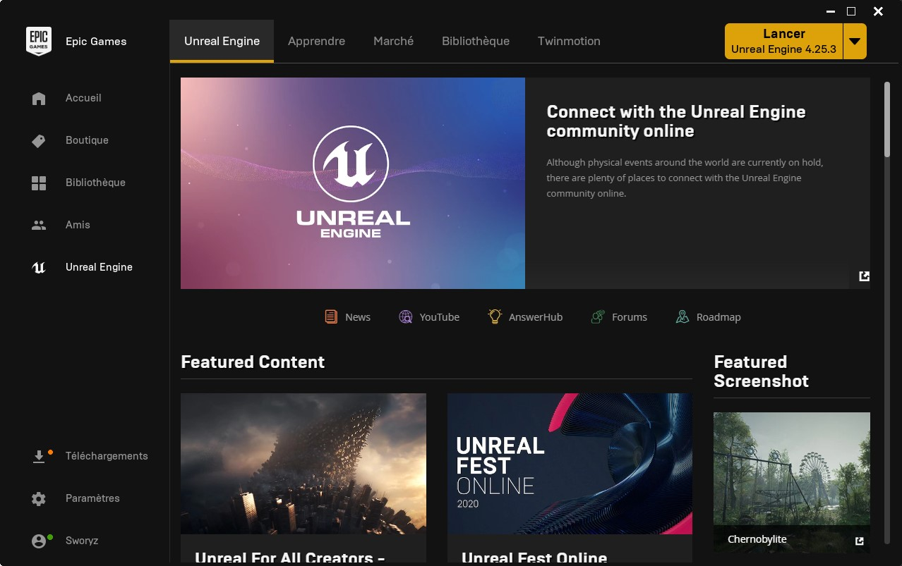
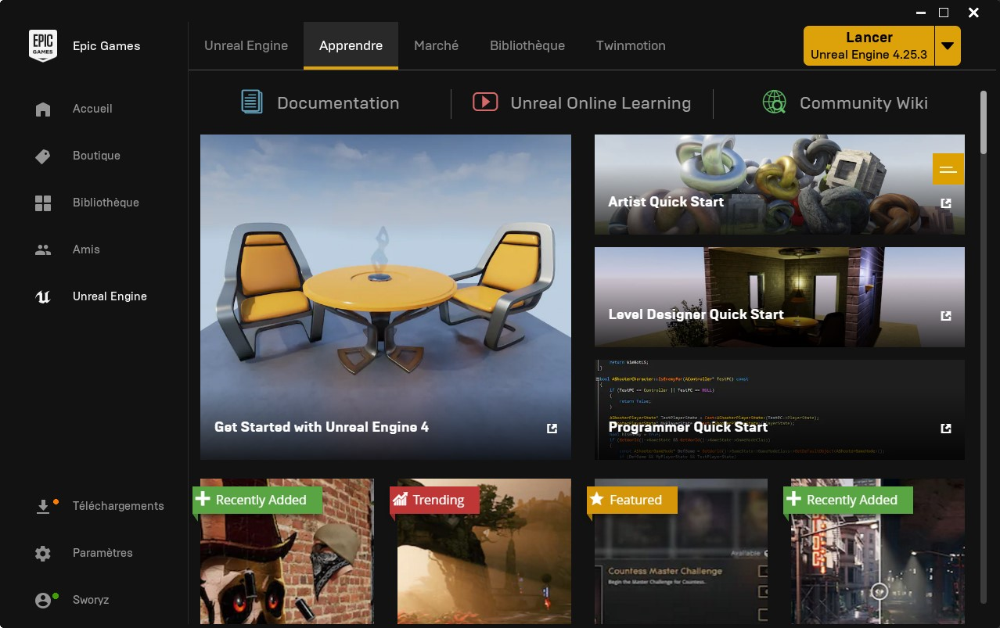
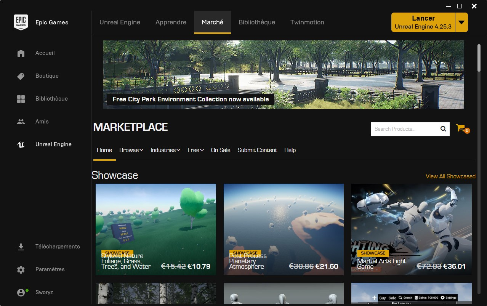
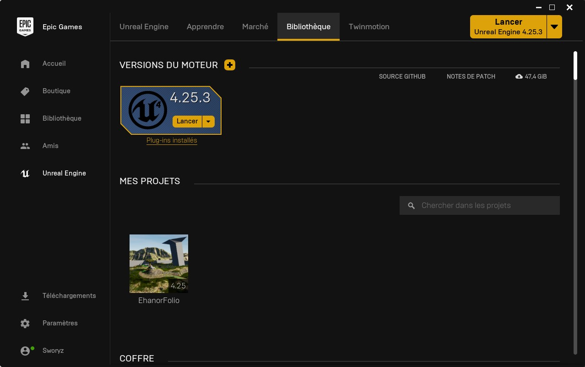
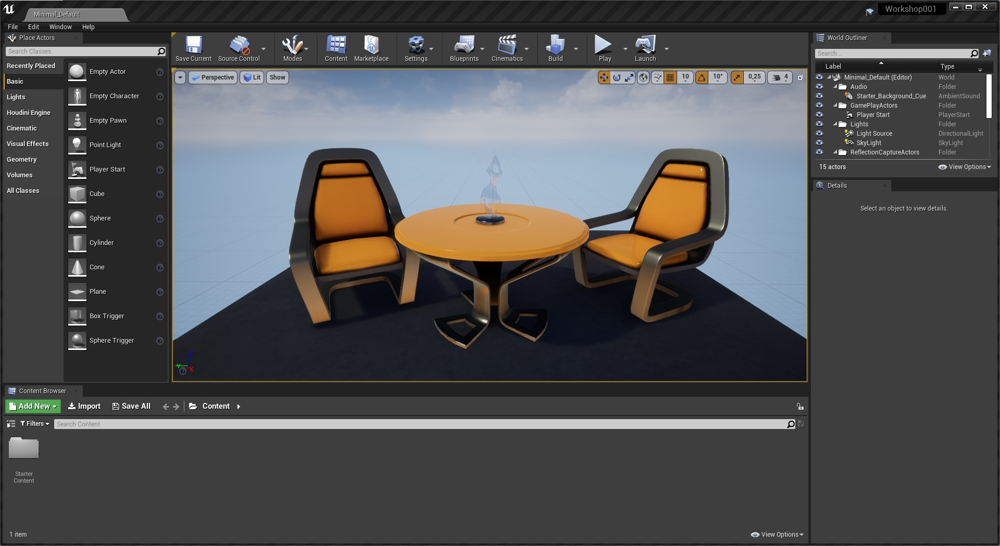
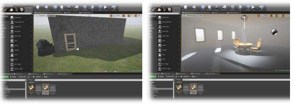
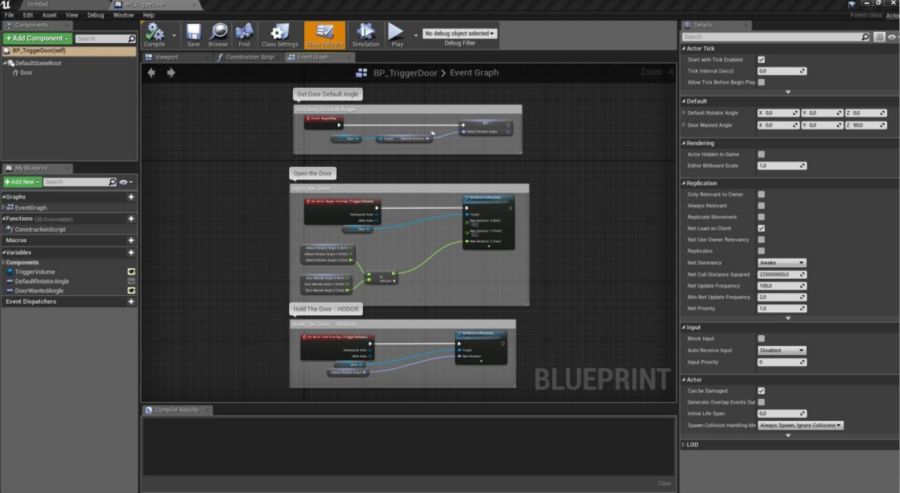
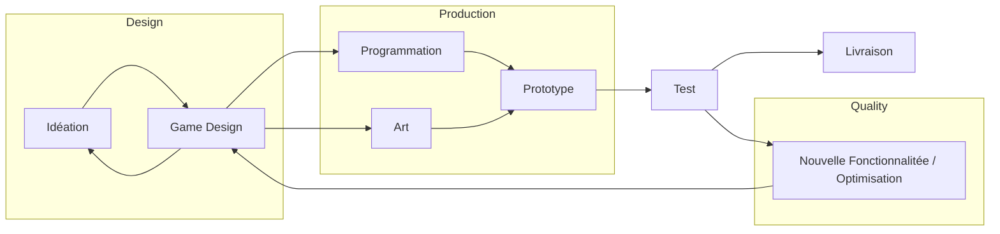

# Unreal Engine Workshop - Partie 1

## Introduction
Bonjour, et bienvenue à tous sur ce Post-Workshop. L'on m'a demandé de vous retranscrire ce Workshop pour pouvoir le reproduire de votre côté. Il évoluera certainement au fur et à mesure de vos retours si des choses sont à corriger par la suite. 

Ni une, ni deux, rentrons dans le vif du sujet !

## Prérequis
- Installer Unreal Engine 4.20 (ou une autre version ultérieure)
- Une souris, c'est plus simple pour naviguer en 3D, la manette fonctionne aussi
- Clavier en QWERTY (Juste passer la langue en ENG suffit pour travailler simplement, ou alors, amusez-vous à modifier les options de l’éditeur ou encore importez un preset Français)

## Résumé de l'Unreal Engine Workshop - Partie 1
En premier, nous allons découvrir l'**Epic Games Launcher**, le cœur d'**Unreal Engine**. Si vous avez l'habitude de l'utiliser pour Fortnite, tant mieux, mais peu de gens regarde la partie **Unreal Engine**. 
Nous allons donc y jeter un œil.

Ensuite, nous regarderons l'**Éditeur**, sa façon de fonctionner, ainsi que l'agencement de ses fonctionnalités.
Vous apprendrez à le modifier à votre convenance, l'utiliser, et à vous poser les bonnes questions.

Vous découvrirez aussi que l'**Unreal Engine** n'est pas seulement un moteur de jeu, mais bien une suite pouvant s'adapter à vos besoins : cinéma, architecture, robotique, intelligence artificielle, réalité augmentée et virtuelle…

Par la suite, nous passerons à notre premier projet en commençant par les bases de l'**Éditeur** en créant notre première maison. D'une pièce au départ, elle s'agrandira par la suite selon votre envie.
Pour cela, nous apprendrons à utiliser les **Materials**, simplement, en les appliquant sur des **Meshes**.
Nous apprendrons aussi à mettre de la lumière dans nos **Scenes** et nous créerons un **Landscape** pour y poser notre maison.

Après avoir pris en main l'**Éditeur**, nous allons débuter la programmation. Ici, pas de **C++** pour que le cours soit accessible à tous, mais de la programmation visuelle : des **Blueprints**.
Premièrement, nous réaliserons une porte automatique s'ouvrant en passant devant. Pour cela, nous apprendrons à importer les **Assets** fourni par Epic Games, ceux du **Launcher**, mais aussi les votre !

Nous parlerons aussi de **Git**, et de comment l'utiliser pour l'**Unreal Engine** !

Pour terminer, je vous laisserai découvrir les **Blueprints** plus en profondeur avec quelques pistes !

## Epic Games Launcher
### **Onglet Unreal Engine (Anciennement Communauté)**
Une fois téléchargé, et installé, vous devriez arriver sur une fenêtre similaire, si non, cliquez sur Unreal Engine dans le choix de la catégorie :

 
Pour le moment, rien de bien compliqué sur cette page ! Vous pouvez y retrouver les news importante en premier plan, les liens de news, channel YouTube d'Unreal, le StackOverflow d'Epic, le Forum et la Roadmap (pas la peine de développer une feature si une qui arrive vous convient ! :smirk:)

En dessous, vous pourrez retrouver les informations récentes, et sur la droite, les projets de la communauté ! D'où son ancien nom : Communauté.

### **Onglet Apprendre**
Le second onglet, l'onglet Apprendre, regroupe pas mal de choses !

 

- <a  href="https://docs.unrealengine.com/en-US/index.html">**Documentation**</a> : Comme son nom l'indique, vous trouverez toute la Documentation de l'Éditeur. Allant simplement de la création de votre premier projet, au scripting de l'éditeur, en passant par la création de test unitaire ou la modification du moteur ! Vous pourrez tout trouver ici. 

- <a  href="https://learn.unrealengine.com/home/dashboard">**Unreal Online Learning**</a> : Anciennement Unreal Academy, ce sont des **MOOC**. Des cours en ligne vidéo quoi, tout simplement. Très utile pour maîtriser certaines fonction de l'éditeur, ou juste pour apprendre. Pas mal de contenu spécialisés (**Quixel**, **Procedural**, **Blueprints**…) 

- <a  href="https://forums.unrealengine.com/unreal-engine/announcements-and-releases/1745504-a-new-community-hosted-unreal-engine-wiki">**Community Wiki**</a> : Devenu poussière, il est peut être en train de renaître de ses cendres grâce à quelques efforts de la communauté. 

- Le reste sont des **Quick Start Guide**, ainsi que des projets template pour se familiariser avec des features ou notions. 

### Onglet Marché
Le troisième onglet, sûrement celui qui fera couler le plus d'encre, j'ai nommé : Le Marché !

 

Le marché est un onglet très intéressant si vous n'êtes pas un artiste dans l'âme. D'ailleurs si vous en êtes un aussi. Vous pouvez trouver énormément d'Assets gratuitement, d'autant plus qu'Epic Games en fourni chaque mois. De plus, rien ne vous empêche de modifier les assets achetés pour les adapter à votre jeu.

Un article était sortie sur le sujet il y a pas mal de temps, si vous souhaitez le retrouver, la partie se nomme **Modify and make assets your own**.

### Onglet Bibliothèque
On arrive enfin aux choses sérieuses, ce qui nous va nous intéresser le plus dans le launcher : la bibliothèque.

 

Je crois qu'ici, tout est explicite, sauf peut-être le **Coffre**. C'est ici que vous pourrez télécharger, ajouter au projet, et parfois créer des projets à partir de ce que vous avez acheté. Vous y retrouverez donc vos plugins, assets et autres démos.

C'est avec cela que nous terminons sur l'Epic Games Launcher. Nous rentrons désormais au coeur de ce Workshop : l'Unreal Engine.

## Unreal Engine 4
### Launcher
Une fois l'Unreal Engine 4 lancé, vous  devriez arriver sur un écran similaire.

 

Créons donc notre premier projet.

Pour cela : Games > Blank > Blueprint ou **C++ si vous comptez en faire, mais notre introduction n'en comportera pas** et gardez bien le Starter Content, sinon vous devrez l'ajouter par la suite. Nommez votre projet, puis **Create Project**.

### Editeur
Après création de votre projet, si vous n'arrivez pas sur une scène similaire à celle-ci. C'est soit que vous avez oublié le Starter Content, soit que votre Projet n'est pas un Jeu.

 

> 🔍 DÉCOUVERTE
>
> Prenez le temps d'explorer l'éditeur, sa gestion des fenêtres, et ses différents menus.
>
> N'hésitez pas à aller voir **Editor Preferences** et **Project Settings** (dans Edit), ils sont très importants !
>

### Votre premier niveau
Désormais, à vous de jouer ! File, New Level… et Default (ou Time Of Day si vous ne souhaitez pas trop vous occuper des lumières).
Le but est d'arriver à un résultat similaire aux images ci-dessous.

 

> 💭 RÉFLEXION
>
> A vous d’essayer ! Essayez de faire quelque chose de similaire (intérieur,
extérieur ou même les deux) ! 
>
> Jouez avec les effets, formes et Materials. Soyez
créatifs !
<>

> 🎯 ASTUCE
>
> N'hésitez pas à utiliser les Box de Geometry en Additive ou Substractive. Voir même l'outil **Geometry Editing**.
>

> 🔍 DÉCOUVERTE
>
> Prenez votre temps et n'hésitez pas à travailler à plusieurs ou demander de l'aide. Vous pouvez même aller voir le <a href="https://docs.unrealengine.com/en-US/Engine/QuickStart/index.html">Quick Start Level Design en cliquant ici</a>.
>

### Blueprints
Les **Blueprints** sont un système de **programmation visuel** développé pour Unreal Engine permettant de scripter son jeu sans savoir programmer.

Cependant, il est aussi complémentaire avec le C++, utiliser les deux permet de gagner du temps tout en ayant une optimisation finale quasi-identique.
Il ne faut pas voir l'un comme le remplaçant de l'autre, mais coinjointement. Même si les Blueprints tendent petit à petit à s'imposer face au C++ d'Unreal au vu de sa facilité...

Voici à quoi cela ressemble !

 

### Votre premier Blueprint
C'est maintenant que cela va devenir intéressant ! Nous allons créer le dernier sort des RPG à la mode ! Non en fait, nous allons simplement faire... Une porte automatique, activé par une **plaque de pression**.

Rien de bien compliqué pour commencer, c'est promis. (Et vous pourrez même en faire un labyrinthe de porte) Juste de quoi se mettre en pleine immersion... ! 🙃

Pour créer votre premier Blueprint, utilisez **Add New** dans le **Content Browser**, et choisissez **Blueprint Class*. Nous allons créer un **Actor**. Un Actor est tout simplement, comme l'éditeur vous l'indique, un objet  pouvant être placé ou pouvant apparaître dans le monde (**Level**). Appelez-moi ça BP_Door. Pourquoi **BP_** ? C'est simple : Un préfixe signalant que l'asset est un Blueprint. Cela est loin d'être obligatoire, mais je trouve cela plus simple à comprendre. L'<a href="https://github.com/Allar/ue4-style-guide">UE4 Style Guide</a> de Allar le propose aussi. L'Asset Naming Convention d'Unreal le proposait aussi, cependant elle n'est plus disponible à la suite de la première fermeture du Wiki... A vous de chercher, des bouts sont disponibles sur Internet, du genre <a href="https://www.gamecoderblog.com/en/unreal-engine4/ue4-recommended-files-naming-convention">ici</a> !

Bon, revenons à nos Blueprints. Ouvrez votre BP_Door. Cette fenêtre que vous venez d'ouvrir est comme un onglet, vous pouvez la mettre dans la liste d'onglet de l'éditeur.

La fenêtre Blueprint se compose de plusieurs parties, contenant elle aussi des onglets :
- **Viewport** : C'est ici que vous gérerez la partie 3D du Blueprint, ajoutant des composants Static Mesh(SM_/S_) ou d'autres choses que vous pourrez découvrir plus tard.
- **Construction Script** : Ce script s’exécutera à chaque instanciation du Blueprint, c’est un
peu grâce à cela que vous pourriez construire un asset procédural.
- **Event Graph** : C’est ici que vous pourrez programmer toute la logique de l’objet, nous
allons y venir pour ouvrir notre porte !
- **Details** : Correspond aux options de l’objet (ou variable) sélectionné.
- **My Blueprint** : Contient les différentes variables, fonctions et macros de votre Blueprint.

Bon, assez parlé, on fait cette porte ? Oui, on y vient. Pour créer cette porte, il nous faut ajouter un **Static Mesh** au **Viewport**, n'est-ce-pas ? Pour cela, allez dans l'onglet Viewport et **Add Component** > **Static Mesh**. Nommez le Door, ou quelque chose du genre... **SM_Door** par hasard 😉 ?

Maintenant, sélectionnez votre Components SM_Door, et utilisez le menu déroulant dans la partie Static Mesh où vous pourrez lui assigner une porte du Starter Content !

Vous n'avez pas ajoutez le Starter Content comme prévu ? Pas bien ! Mais pas bien grave, pour l'ajouter, faites comme lorsque vous avez voulu créer votre Blueprint : **Add New** > **Add Feature or Content Pack** (tout en haut) > **Content Packs** > **Starter Content**.

Tadah ! Vous pouvez sauvegarder, votre premier Blueprint fonctionne ! C'est super cool non ? Enfin... Ce n'est pas comme si il faisait quelque chose pour le moment... !

Je vous laisse vous amuser avec l'éditeur, et plus précisement ce qui se trouve dans votre Blueprint, une fois ceci fait, vous pourrez passer à la partie suivante !

> 🔍 DÉCOUVERTE
>
> Prenez votre temps et n'hésitez pas à travailler à plusieurs ou demander de l'aide.
> Si vous n'êtes pas à l'aise, cela pourrait s'avérer compliqué par la suite ! Alors, prenez votre temps.
> A vous de jouer !
>

# Bonus
## Comment est-ce que l'on crée un jeu ?

Voici un modèle **très** simplifié que j'aime bien présenter : les étapes de création d'un jeu vidéo.
<table align="center">
<tr>
<td align="center" width="9999">

</td>
</tr>
</table>

Alors oui, cela ne correpondra sûrement pas à la méthodologie qu'utilise Ubisoft, mais le principe est là, surtout pour une Game Jam.

## Assets
Vous trouverez ici les [**Assets**](/assets) que j'ai jugé pertinent de vous donner.  
- Le **BP_Character_Master.uasset** vous permet d'utiliser tout personnage de Paragon (mais aussi d'autres en 3D) à récupérer sur le Marketplace, très simplement en peu de temps en créant un Child Blueprint, ou non. Presque toute la logique de déplacement et d'action à été mise en place, basé sur celui de Shinbi, asset gratuit fourni par Epic Games.

# Crédits
Les images du moteur et du launcher ainsi que les assets de l'éditeur sont la propriétés d'Epic Games.\
Le contenu du cours a été écrit dans le cadre d'une présentation à des Coding Club et Hub d'Epitech Lyon.\
Merci à Thomas pour son aide à l'élaboration de ce cours !\
Si vous avez une question, un retour à me faire, ou autre, contactez moi via <a href="mailto:matthieu.eynard-longuet@epitech.eu">**matthieu.eynard-longuet@epitech.eu**</a>.

Pour plus d'informations : <a href="https://matthieu.ehanor.fr/">**https://matthieu.ehanor.fr/**</a>.
